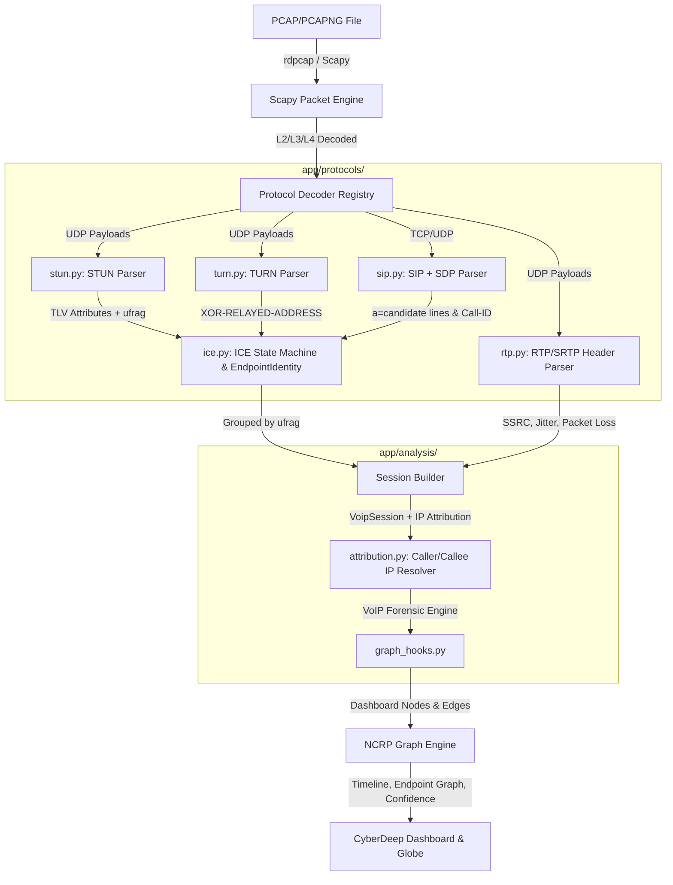

# Implementation Plan v2 — VoIP Protocol Engine & Session Forensics (with Caller/Callee IP Attribution)

This plan upgrades the VoIP forensics capability to resolve correlation bugs, implement direct caller/callee IP attribution, address SDP/SIP gaps, and integrate output into the existing NCRP graph engine.

---

## 1. Architectural Design



### Correlation Key & Attribute Definitions
* **Correlation Key:** Group sessions by the `ufrag` pair extracted from the STUN `USERNAME` attribute. Since the `USERNAME` format is `remoteUfrag:localUfrag` (colon-separated), the split assigns `remoteUfrag` to the Callee side and `localUfrag` to the Caller side.
* **NAT Type Guess (`nat_type_guess`):** Restrict values to the strict enum: `"unknown" | "symmetric" | "full_cone" | "restricted" | "port_restricted"`.
* **VoIP Session Relays (`turn_servers`):** Defined as a list of unique string relay server socket addresses (e.g. `['116.119.85.96:3478']`) for display, preventing redundancy with candidate records.
* **NCRP Graph Schema Compatibility:** Confirmed existing dashboard graph structure:
  * Node: `{"id": str, "label": str, "role": str, "confidence": int, "asn": str, "country": str}`
  * Edge: `{"source": str, "target": str, "label": str, "protocol": str, "weight": int}`
  Our `graph_hooks.py` maps VoIP sessions directly to these schemas.

---

## 2. Build Sequence & proposed Changes

To allow progressive testing, the components will be implemented in the following order:

```
[Stage 1: stun.py] ──> [Stage 2: turn.py] ──> [Stage 3: rtp.py] ──> [Stage 4: sip.py]
                                                                          │
[Stage 7: graph_hooks] <── [Stage 6: models/attribution] <── [Stage 5: ice.py] <──┘
```

### [Component: VoIP Protocol Engine]

#### [NEW] [stun.py](file:///d:/cyberdeep/app/protocols/stun.py)
* Parses 20-byte STUN header (Message Type, Length, Magic Cookie `0x2112A442`, Transaction ID).
* Iteratively parses attributes (`USERNAME`, `XOR-MAPPED-ADDRESS`, `MAPPED-ADDRESS`, `PRIORITY`, `ICE-CONTROLLING`, `ICE-CONTROLLED`, `USE-CANDIDATE`, `MESSAGE-INTEGRITY`, `FINGERPRINT`, `ERROR-CODE`, `REALM`, `NONCE`, `SOFTWARE`).
* XORs mapped addresses against `0x2112A442` (IPv4) or `Magic Cookie + Transaction ID` (IPv6).
* Includes bounds-checked attribute parsing to gracefully return a `ParseError` on malformed packets without crashing.

#### [NEW] [turn.py](file:///d:/cyberdeep/app/protocols/turn.py)
* Decodes TURN allocations (`Allocate`, `Refresh`, `CreatePermission`, `ChannelBind`, `Send-Indication`, `Data-Indication`).
* Extracts `XOR-RELAYED-ADDRESS` and `XOR-PEER-ADDRESS`.
* Tag relay-sourced IPs explicitly.

#### [NEW] [rtp.py](file:///d:/cyberdeep/app/protocols/rtp.py)
* Extracts RTP/SRTP headers (SSRC, sequence numbers, timestamps, payload types).
* Computes jitter, packet loss rates, and MOS quality estimates. SRTP payload decryption is deferred.

#### [NEW] [sip.py](file:///d:/cyberdeep/app/protocols/sip.py)
* Decodes SIP text messages (`INVITE`, `200 OK`, `BYE`), extracting `Call-ID`, routing fields (`From`, `To`), and embedded SDP body properties.
* Parses SDP `a=candidate` lines to cross-verify expected ICE candidates against observed traffic.

#### [NEW] [ice.py](file:///d:/cyberdeep/app/protocols/ice.py)
* Implements `IceCandidate` and `EndpointIdentity` classes.
* Tracks `IceStateMachine` transitions (`NEW` $\rightarrow$ `GATHERING` $\rightarrow$ `CHECKING` $\rightarrow$ `CONNECTED` $\rightarrow$ `COMPLETED` / `FAILED` / `RELAYED`).

#### [NEW] [models.py](file:///d:/cyberdeep/app/protocols/models.py)
* Implements `VoipSession` model container.

### [Component: Forensic Analysis & Attribution]

#### [NEW] [attribution.py](file:///d:/cyberdeep/app/analysis/attribution.py)
* Resolves endpoint identities. Correlates candidates and signaling metadata. Detects port-evasion, session hijack, and SSRC injection anomalies.

#### [MODIFY] [pcap_parser.py](file:///d:/cyberdeep/app/parsers/pcap_parser.py)
* Route incoming UDP/TCP streams on VoIP-relevant ports to the protocol registry.

#### [MODIFY] [traffic.py](file:///d:/cyberdeep/app/analysis/traffic.py)
* Integrate `SessionBuilder` and ufrag correlation grouping logic.

#### [NEW] [graph_hooks.py](file:///d:/cyberdeep/app/analysis/graph_hooks.py)
* Maps `VoipSession` instances to NCRP-compatible node/edge dictionaries.

---

## 3. Verification Plan

### Automated Tests (`scratch/test_voip_engine.py`)
* Test ICE state transitions: `NEW` $\rightarrow$ `GATHERING` $\rightarrow$ `CHECKING` $\rightarrow$ `CONNECTED`.
* Verify `decode_xor_mapped_address` against RFC 5389 test vectors:
  * IPv4 Direct: `192.0.2.1:54321`
  * IPv4 NAT: `203.0.113.45:51234`
  * IPv6 WebRTC: `2001:db8::1:49152`
* Validate attribution confidence levels: `direct`, `relay_only`, `unresolved`.
* Run malformed packet boundary checks (truncated headers, bad attribute lengths, invalid magic cookie) to verify parser safety.
* Compute RTP QoS metrics (Jitter, Packet Loss, MOS) and verify against reference data.

### Manual Verification
* Ingest traces containing VoIP sessions and verify the dashboard shows the precise caller and callee attributes with correct NAT and relay markers.
